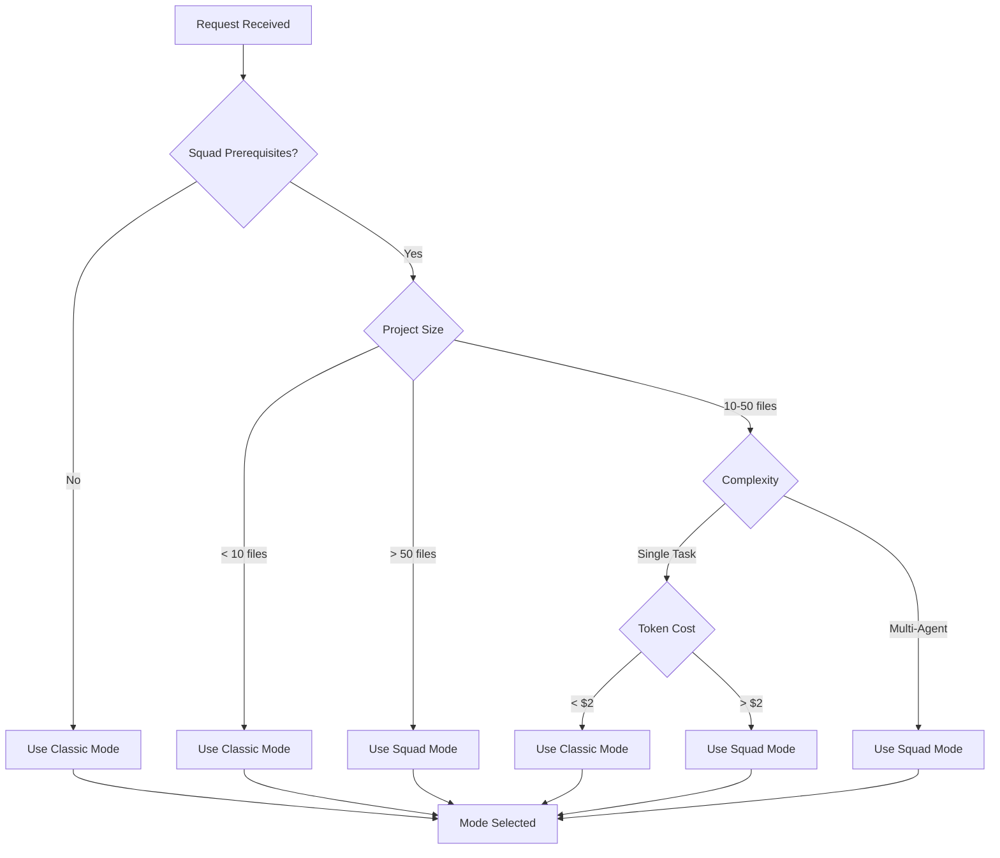

# AI Agent Hub Mode Selection Rules

## Overview
AI Agent Hub supports two operational modes: **Classic** and **Squad**. This document defines the rules and heuristics for selecting the optimal mode based on project characteristics and user requirements.

## Mode Comparison

### Classic Mode
- **Token Usage**: Full agent prompts (~37,500 tokens across 9 agents)
- **Execution**: Sequential, single-agent at a time
- **Best For**: Simple tasks, small projects, learning/exploration
- **Setup Time**: Instant
- **Complexity**: Low

### Squad Mode
- **Token Usage**: Slim templates (~1,080 tokens, 97% reduction)
- **Execution**: Parallel, up to 4 concurrent agents
- **Best For**: Complex features, large projects, production work
- **Setup Time**: Requires squad infrastructure
- **Complexity**: Medium (managed by supervisor)

## Automatic Mode Selection Rules

### Rule 1: Project Size
```yaml
if (project_files < 10):
  mode: classic
  reason: "Small projects don't benefit from Squad coordination overhead"

elif (project_files > 50):
  mode: squad
  reason: "Large projects benefit from parallel execution and token efficiency"

else:
  mode: classic
  reason: "Medium projects default to simpler Classic mode"
```

### Rule 2: Request Complexity
```yaml
if (single_feature_request):
  mode: classic
  reason: "Single features can be handled sequentially"

elif (multi_agent_coordination_required):
  mode: squad
  reason: "Complex tasks benefit from supervisor orchestration"
```

### Rule 3: Token Cost Estimation
```yaml
estimated_tokens = calculate_token_usage(request)
estimated_cost = (estimated_tokens / 1000) * 0.01

if (estimated_cost > 2.00):
  mode: squad
  reason: "High token cost justifies Squad efficiency (97% reduction)"

else:
  mode: classic
  reason: "Low token cost doesn't require optimization"
```

### Rule 4: User Intent Signals
```yaml
if (user_mentions_parallel OR user_mentions_concurrent):
  mode: squad
  reason: "User explicitly wants parallel execution"

elif (user_mentions_simple OR user_mentions_basic):
  mode: classic
  reason: "User prefers simplicity over optimization"
```

### Rule 5: Squad Prerequisites
```yaml
required_files = [
  '.squad/templates/',
  '.squad/analysis/',
  '.squad/supervisor-rules.md',
  '.squad/communication-protocol.md'
]

if (not all_files_exist(required_files)):
  mode: classic
  reason: "Squad infrastructure not available"
```

## Manual Mode Selection Guidelines

### Choose Classic Mode When:
1. **Learning the system** - Classic is easier to understand and debug
2. **Quick prototypes** - No coordination overhead needed
3. **Small changes** - Single file edits, minor bug fixes
4. **Limited resources** - Running on constrained environments
5. **Simple workflows** - Linear, predictable task sequences

### Choose Squad Mode When:
1. **Building features** - Multi-component features requiring coordination
2. **Performance matters** - Need faster completion through parallelism
3. **Token budget concerns** - 97% token reduction saves significant costs
4. **Complex architecture** - Frontend + backend + database work
5. **Team simulation** - Want to simulate how a real team would work

## Mode Switching Decision Tree



## Implementation Examples

### Example 1: Small Bug Fix
```
Request: "Fix the typo in the header component"
Analysis:
- Single file change
- No coordination needed
- Estimated tokens: ~500
Selected Mode: CLASSIC
Reason: Simple single-agent task
```

### Example 2: New Feature Development
```
Request: "Add user authentication with social login"
Analysis:
- Frontend components needed
- Backend API endpoints required
- Database schema updates
- Estimated tokens: ~15,000
Selected Mode: SQUAD
Reason: Multi-agent coordination beneficial
```

### Example 3: Code Refactoring
```
Request: "Refactor the payment module to use new API"
Analysis:
- Multiple file changes
- Testing required
- Estimated tokens: ~8,000
Selected Mode: SQUAD
Reason: Parallel execution speeds up refactoring
```

### Example 4: Documentation Update
```
Request: "Update the README with new installation steps"
Analysis:
- Single file edit
- No code changes
- Estimated tokens: ~200
Selected Mode: CLASSIC
Reason: Simple documentation task
```

## Mode Migration Triggers

### Upgrade to Squad Mode When:
1. Classic mode tasks taking > 10 minutes
2. Repeated coordination failures between agents
3. Token usage exceeding budget thresholds
4. User requesting parallel execution
5. Project growth crosses 50-file threshold

### Downgrade to Classic Mode When:
1. Squad coordination overhead exceeding benefits
2. Simple maintenance phase of project
3. Debugging requiring step-by-step visibility
4. Squad infrastructure corrupted or incomplete
5. User preference for simpler workflow

## Performance Metrics

### Classic Mode Benchmarks
- Average task completion: 2-5 minutes
- Token usage: 4,000-8,000 per task
- Success rate: 95% for simple tasks
- Error recovery: Manual intervention

### Squad Mode Benchmarks
- Average task completion: 1-3 minutes (with parallelism)
- Token usage: 400-800 per task (97% reduction)
- Success rate: 90% for complex tasks
- Error recovery: Automatic via supervisor

## Configuration Override

Users can force a specific mode using CLI flags:

```bash
# Force Classic mode
npx ai-agent-hub --mode classic

# Force Squad mode
npx ai-agent-hub --mode squad

# Auto-detect optimal mode
npx ai-agent-hub --mode auto
```

## Mode Persistence

The selected mode is persisted in `.ai-hub/current-mode.json`:

```json
{
  "mode": "squad",
  "timestamp": "2024-01-15T10:30:00Z",
  "version": "3.0.6",
  "reason": "Large project detected (75 files)"
}
```

## Troubleshooting Mode Selection

### Common Issues

1. **Squad mode fails to activate**
   - Check: Squad prerequisites installed?
   - Solution: Run `npx ai-agent-hub setup-squad`

2. **Classic mode too slow**
   - Check: Task complexity appropriate?
   - Solution: Consider upgrading to Squad mode

3. **Auto-detection choosing wrong mode**
   - Check: Project structure analyzed correctly?
   - Solution: Use manual mode flag

4. **Mode switching causes errors**
   - Check: Backup created successfully?
   - Solution: Rollback using backup, retry migration

## Future Enhancements

### Planned Improvements
1. **Hybrid Mode**: Mix Classic and Squad per task
2. **Adaptive Mode**: Dynamic switching during execution
3. **Custom Rules**: User-defined mode selection criteria
4. **Mode Analytics**: Track performance per mode
5. **Smart Caching**: Mode-specific optimization caches

### Experimental Features
- **Quantum Mode**: Superposition of both modes (research phase)
- **Swarm Mode**: 10+ parallel agents (requires infrastructure)
- **Minimal Mode**: Single agent, maximum efficiency

## Summary

Mode selection is critical for optimal AI Agent Hub performance:
- **Classic**: Simple, reliable, full-featured
- **Squad**: Efficient, parallel, token-optimized
- **Auto**: Intelligent selection based on context

Choose the mode that matches your project's needs and complexity level. When in doubt, start with Classic and upgrade to Squad as needed.