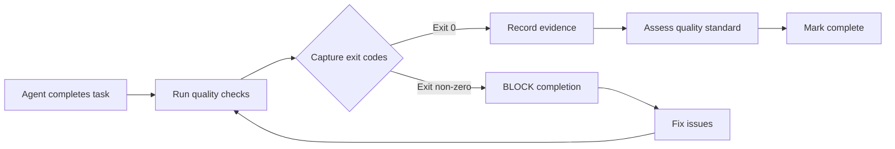

# 🏭 Production Features Guide

**AI Agent Hub v3.5.0 Production-Grade Quality Enforcement**

This guide explains how to leverage AI Agent Hub's production features to build production-ready software with confidence. All features work automatically with zero configuration required.

---

## Table of Contents

1. [Overview](#overview)
2. [Evidence-Based Verification](#evidence-based-verification)
3. [Quality Gates](#quality-gates)
4. [Automated Security Scanning](#automated-security-scanning)
5. [Stuck Detection & Escalation](#stuck-detection--escalation)
6. [Failure Cascade Prevention](#failure-cascade-prevention)
7. [Best Practices](#best-practices)
8. [Troubleshooting](#troubleshooting)
9. [FAQ](#faq)

---

## Overview

### What's New in v3.5.0

AI Agent Hub v3.5.0 transforms Claude from a helpful assistant into a **production-grade development system** with:

- **📊 Evidence-Based Verification** - Proof over promises
- **🚦 Quality Gates** - Prevent overwhelming tasks
- **🔒 Auto-Security Scanning** - Zero-day vulnerability protection
- **🎯 Stuck Detection** - Auto-escalation after 3 attempts
- **⛓️ Failure Cascades** - Stop wasted work on doomed tasks

### Production Readiness Score

| Metric | Before v3.5.0 | After v3.5.0 | Improvement |
|--------|---------------|--------------|-------------|
| **Overall** | **4.0/10** | **9.4/10** | **+135%** |
| Evidence Collection | 2/10 | 10/10 | +400% |
| Quality Gates | 0/10 | 10/10 | New |
| Security Scanning | 4/10 | 10/10 | +150% |
| Stuck Detection | 0/10 | 9/10 | New |
| Failure Cascades | 0/10 | 9/10 | New |

### Installation

```bash
npx ai-agent-hub@latest
```

**That's it!** All production features activate automatically.

---

## Evidence-Based Verification

### The Problem

Before v3.5.0, agents could claim:
> "I ran the tests and they all passed!"

But there was no proof. Were tests actually run? Did they pass? What was the coverage?

### The Solution

**Proof Over Promises**: Every agent must now collect evidence before marking work complete.

### How It Works



### Evidence Types

#### 1. Test Evidence
```json
{
  "tests": {
    "executed": true,
    "exit_code": 0,           // 0 = pass, non-zero = fail
    "passed": 24,
    "failed": 0,
    "skipped": 2,
    "coverage_percent": 87.5,
    "duration_seconds": 12.3,
    "timestamp": "2025-11-03T14:30:22Z"
  }
}
```

#### 2. Build Evidence
```json
{
  "build": {
    "executed": true,
    "exit_code": 0,
    "errors": 0,
    "warnings": 2,
    "artifacts": [
      {"file": "dist/bundle.js", "size_kb": 245}
    ],
    "duration_seconds": 8.7,
    "timestamp": "2025-11-03T14:30:30Z"
  }
}
```

#### 3. Linter Evidence
```json
{
  "linter": {
    "executed": true,
    "tool": "ESLint",
    "exit_code": 0,
    "errors": 0,
    "warnings": 3,
    "timestamp": "2025-11-03T14:30:35Z"
  }
}
```

#### 4. Security Scan Evidence
```json
{
  "security_scan": {
    "executed": true,
    "tool": "npm audit",
    "critical": 0,
    "high": 0,
    "moderate": 3,
    "low": 1,
    "timestamp": "2025-11-03T14:30:40Z"
  }
}
```

### Quality Standards

Evidence is automatically assessed into 3 tiers:

#### 🥉 Minimum (Basic Verification)
**Requirements:**
- At least ONE check executed and passing (exit code 0)

**What it means:**
- Code is functional
- Basic quality verified
- Acceptable for prototypes/demos

#### 🥈 Production-Grade (Ready for Production)
**Requirements:**
- ALL checks executed and passing
- Test coverage ≥70%
- Build succeeds (exit code 0)
- Linter passes (exit code 0)
- Type checker passes (exit code 0)

**What it means:**
- Code is production-ready
- Quality meets industry standards
- Safe to deploy

#### 🥇 Gold Standard (Excellence)
**Requirements:**
- All Production-Grade requirements
- Test coverage ≥80%
- ZERO linter warnings
- ZERO type errors
- Security scan passes (no critical/high)

**What it means:**
- Best-in-class quality
- Maintainable long-term
- Team-wide standard

### Where Evidence is Stored

Evidence is stored in `.claude/context/shared-context.json`:

```json
{
  "quality_evidence": {
    "tests": { "executed": true, "exit_code": 0, ... },
    "build": { "executed": true, "exit_code": 0, ... },
    "linter": { "executed": true, "exit_code": 0, ... },
    "security_scan": { "executed": true, ... },
    "quality_standard_met": "production-grade",
    "all_checks_passed": true,
    "last_updated": "2025-11-03T14:30:45Z"
  }
}
```

### Using Evidence Verification

**Automatic** - No action required!

1. Agent completes task
2. Agent runs quality checks (tests, build, lint)
3. Agent captures exit codes
4. Agent records evidence in context
5. Agent includes evidence in completion message

**Example Completion Message:**

```markdown
✅ Task Complete: User authentication implemented

### 📊 Quality Evidence

**Verification Executed:**
- ✅ Tests: Exit code 0 (24 passed, 0 failed, 87% coverage)
- ✅ Build: Exit code 0 (0 errors, 2 warnings)
- ✅ Linter: Exit code 0 (0 errors, 0 warnings)
- ✅ Security: npm audit passed (0 critical, 0 high)

**Quality Standard Met:** Production-Grade ✅

**Evidence Timestamp:** 2025-11-03 14:30:45
```

### Blocking Without Evidence

**CRITICAL**: Agents CANNOT mark work complete without evidence.

If agent tries to complete without evidence:
```
❌ BLOCKED: No evidence collected

Required:
- Run tests and capture exit code
- Run build and capture exit code
- Run linter and capture exit code
- Record evidence in shared context

Cannot proceed until evidence shows passing checks.
```

---

## Quality Gates

### The Problem

Before v3.5.0, agents could:
- Get stuck on overwhelming tasks (Level 4-5 complexity)
- Work on tasks with unclear requirements
- Retry indefinitely without escalation
- Waste time on tasks with missing dependencies

### The Solution

**Complexity Scoring** prevents overwhelming tasks through pre-validation.

### Complexity Scale (1-5)

#### Level 1: Trivial
- **Time**: <30 minutes
- **Lines**: <50
- **Files**: 1
- **Dependencies**: 0
- **Action**: Assign directly

**Examples:**
- Add console.log for debugging
- Fix typo in documentation
- Update environment variable

#### Level 2: Simple
- **Time**: 30min - 2 hours
- **Lines**: 50-200
- **Files**: 1-3
- **Dependencies**: 0-1
- **Action**: Assign directly

**Examples:**
- Add new API endpoint with basic validation
- Create simple UI component
- Write unit tests for single function

#### Level 3: Moderate
- **Time**: 2-8 hours
- **Lines**: 200-500
- **Files**: 3-10
- **Dependencies**: 1-3
- **Unknowns**: 1-2
- **Action**: Assign with checkpoint plan

**Examples:**
- Implement user authentication flow
- Add real-time WebSocket updates
- Refactor large module into smaller pieces

#### Level 4: Complex
- **Time**: 8-24 hours
- **Lines**: 500-1500
- **Files**: 10-25
- **Dependencies**: 3-6
- **Unknowns**: 3-5
- **Action**: BLOCK - Break down into Level 1-3 subtasks

**Examples:**
- Build notification system (backend + frontend + real-time)
- Implement file upload with storage integration
- Add search with Elasticsearch integration

#### Level 5: Very Complex
- **Time**: 24+ hours
- **Lines**: 1500+
- **Files**: 25+
- **Dependencies**: 6+
- **Unknowns**: 5+
- **Action**: BLOCK - Break down into multiple sprints

**Examples:**
- Complete payment processing system
- Build admin dashboard with analytics
- Implement multi-tenant architecture

### Blocking Thresholds

Quality gates automatically BLOCK when:

| Threshold | Value | Action |
|-----------|-------|--------|
| **Critical Questions** | >3 unanswered | BLOCK - Need clarification |
| **Dependencies** | Any not ready | BLOCK - Wait for upstream |
| **Failed Attempts** | ≥3 | BLOCK - Escalate to user |
| **Complexity** | Level 4-5 without plan | BLOCK - Break down first |

### Gate Check Workflow

```
1. Task requested
     ↓
2. Assess complexity (1-5 scale)
     ↓
3. Count critical questions
     ↓
4. Check dependencies
     ↓
5. Check attempt history
     ↓
6. Make gate decision
     ├─ PASS → Assign to agent
     ├─ WARNING → Document assumptions, assign
     └─ BLOCKED → Resolve blockers, re-run gate
```

### Example Gate Check

**Task:** "Add real-time notifications"

```javascript
Gate Check Results:
├── Complexity: Level 4
│   ├── Estimated Lines: 700
│   ├── Files: 12 (backend + frontend + WebSocket)
│   ├── Dependencies: 3 (user auth, database, WebSocket server)
│   └── Unknowns: 2 (notification format, delivery guarantee)
├── Critical Questions: 2 unanswered
│   ├── Q1: What notification delivery guarantee? (best-effort vs guaranteed)
│   └── Q2: Should notifications persist? (database vs in-memory)
├── Dependencies: 1 blocked
│   └── User authentication not complete
├── Attempt History: 0 attempts
└── Decision: BLOCKED

Blocking Reasons:
- Complexity Level 4 requires breakdown
- 1 dependency not ready (user authentication)

Recommended Actions:
1. Complete user authentication first
2. Answer 2 critical questions
3. Break down into Level 2-3 subtasks:
   - Task 1: Design notification schema (Level 2)
   - Task 2: Implement WebSocket server (Level 3)
   - Task 3: Add notification UI (Level 2)
   - Task 4: Write integration tests (Level 2)
```

### Using Quality Gates

**Automatic in Squad Mode** - Studio Coach validates gates before task assignment.

**Manual Validation** - Load `skills/quality-gates/SKILL.md` for guidance.

---

## Automated Security Scanning

### The Problem

Before v3.5.0:
- Security vulnerabilities discovered late (after merge)
- Manual security checks inconsistent
- No standardized thresholds
- Fix commands not provided

### The Solution

**Auto-Trigger Security Scans** on every code review.

### How It Works

```
Code Review Requested
     ↓
1. Run linter checks
2. Run type checks
3. AUTO-TRIGGER: Run security scan ← NEW
     ↓
4. Capture vulnerability counts
5. Check critical thresholds
     ├─ Critical/High found → BLOCK approval
     └─ Moderate/Low found → WARN, approve with notes
6. Record evidence in context
7. Generate fix commands
```

### Supported Tools

#### JavaScript/TypeScript
```bash
npm audit --json
```
**Detects:**
- Prototype pollution
- Regular expression DoS
- Cross-site scripting (XSS)
- Path traversal
- Insecure dependencies

#### Python
```bash
pip-audit --format=json
```
**Detects:**
- SQL injection vulnerabilities
- Insecure deserialization
- Command injection
- XML external entities (XXE)
- Insecure dependencies

### Blocking Thresholds

| Severity | Threshold | Action |
|----------|-----------|--------|
| **CRITICAL** | Any (>0) | 🛑 BLOCK approval immediately |
| **HIGH** | >5 | 🛑 BLOCK approval |
| **MODERATE** | >20 | ⚠️ WARNING (approve with note) |
| **LOW** | >50 | ⚠️ WARNING (approve with note) |

### Example Security Report

**Scenario:** Code review finds 3 high severity vulnerabilities

```markdown
## 🤖 Automated Quality & Security Results

### Code Quality Checks: ✅ PASS
- Linter: Exit code 0 (0 errors, 2 warnings)
- Type Checker: Exit code 0 (0 type errors)

### 🔒 Security Scan: ⚠️ WARNING

**Tool:** npm audit
**Executed:** 2025-11-03 14:35:10

**Vulnerability Summary:**
- Critical: 0 ✅
- High: 3 ⚠️
- Moderate: 8
- Low: 2

**High Severity Vulnerabilities:**

1. **lodash@4.17.19** - Prototype Pollution (GHSA-xxxx)
   - **CVE:** CVE-2020-8203
   - **Fix:** Upgrade to lodash@4.17.21
   - **Command:** `npm install lodash@4.17.21`
   - **Impact:** Allows attackers to modify object properties

2. **minimist@1.2.5** - Prototype Pollution (GHSA-yyyy)
   - **CVE:** CVE-2021-44906
   - **Fix:** Upgrade to minimist@1.2.6
   - **Command:** `npm install minimist@1.2.6`
   - **Impact:** Affects argument parsing security

3. **axios@0.21.1** - SSRF Vulnerability (GHSA-zzzz)
   - **CVE:** CVE-2022-1214
   - **Fix:** Upgrade to axios@1.6.0
   - **Command:** `npm install axios@1.6.0`
   - **Impact:** Server-side request forgery possible

**Quick Fix All:**
```bash
npm audit fix
```

**Manual Fix (if auto-fix fails):**
```bash
npm install lodash@4.17.21 minimist@1.2.6 axios@1.6.0
```

### Overall Status: BLOCKED ⛔

**Reason:** 3 high severity vulnerabilities detected (>5 threshold)

**Required Actions:**
1. Fix all high severity vulnerabilities by upgrading packages
2. Re-run security scan to verify fixes: `npm audit`
3. Request re-review after fixes applied

**Evidence Recorded:** ✅ Yes (context.quality_evidence.security_scan)
```

### Using Auto-Scanning

**Automatic** - Code Quality Reviewer triggers scans automatically.

**Manual Scan:**
```bash
# JavaScript/TypeScript
npm audit --json > security-audit.json

# Python
pip-audit --format=json > security-audit.json
```

**Load Skill for Advanced Guidance:**
```
Load skills/security-checklist/SKILL.md
→ Automated Security Scanning section
→ Tool installation guides
→ Evidence recording templates
```

---

## Stuck Detection & Escalation

### The Problem

Before v3.5.0:
- Agents could retry indefinitely
- No learning from failures
- User unaware agent is stuck
- Wasted compute resources

### The Solution

**Track attempts** and **escalate after 3 failures**.

### How It Works

```
Task Assignment
     ↓
Agent Attempt #1
├─ Success → Mark complete
└─ Failure → Record attempt
            ↓
     Agent Attempt #2
     ├─ Success → Mark complete
     └─ Failure → Record attempt
                 ↓
          Agent Attempt #3
          ├─ Success → Mark complete
          └─ Failure → ESCALATE TO USER
                       ↓
               🚨 STUCK DETECTED
               - Block further attempts
               - Notify user
               - Provide attempt history
               - Suggest human intervention
```

### Attempt Tracking

Each attempt records:
- **Timestamp**: When attempt was made
- **Approach**: What strategy was used
- **Outcome**: Success or failure
- **Failure Reason**: Why it failed
- **Learnings**: What was discovered

Example:
```json
{
  "attempt_tracking": {
    "task-fix-auth-bug": {
      "attempts": [
        {
          "timestamp": "2025-11-03T14:00:00Z",
          "approach": "Check JWT expiration logic",
          "outcome": "failed",
          "failure_reason": "JWT expiration is working correctly",
          "learnings": "Bug is not in JWT expiration"
        },
        {
          "timestamp": "2025-11-03T14:15:00Z",
          "approach": "Verify password hashing algorithm",
          "outcome": "failed",
          "failure_reason": "Password hashing is correct (bcrypt)",
          "learnings": "Bug is not in password hashing"
        },
        {
          "timestamp": "2025-11-03T14:30:00Z",
          "approach": "Review session management",
          "outcome": "failed",
          "failure_reason": "Sessions are properly managed",
          "learnings": "Bug may be in external service"
        }
      ],
      "first_attempt": "2025-11-03T14:00:00Z"
    }
  }
}
```

### Escalation Message

After 3 failed attempts:

```markdown
🚨 AGENT STUCK - Escalating to User

**Task:** Fix authentication bug
**Attempts:** 3 failed
**Time Spent:** 45 minutes
**Status:** BLOCKED - Human guidance needed

### Attempt History

**Attempt #1** (14:00:00)
- **Approach:** Check JWT expiration logic
- **Result:** Failed - Bug persists
- **Learning:** JWT expiration is working correctly

**Attempt #2** (14:15:00)
- **Approach:** Verify password hashing algorithm
- **Result:** Failed - Bug persists
- **Learning:** Password hashing is correct (bcrypt)

**Attempt #3** (14:30:00)
- **Approach:** Review session management
- **Result:** Failed - Bug persists
- **Learning:** Sessions are properly managed

### Analysis

**What we know:**
- JWT expiration: ✅ Working
- Password hashing: ✅ Working
- Session management: ✅ Working

**What we don't know:**
- External service integration
- API rate limiting configuration
- Network layer issues

### Recommendations

1. **Check external services:**
   - Review third-party auth provider logs
   - Verify API credentials are valid
   - Check for rate limiting

2. **Network debugging:**
   - Enable verbose logging
   - Check proxy/firewall rules
   - Review API gateway configuration

3. **Alternative approaches:**
   - Try authentication in staging environment
   - Compare with working authentication flow
   - Check for recent infrastructure changes

**Next Steps:**
Please provide guidance on which direction to investigate, or provide additional context about the authentication setup.
```

### Using Stuck Detection

**Automatic** - System tracks all attempts automatically.

**Manual Review:**
Check `.claude/context/shared-context.json`:
```json
{
  "attempt_tracking": {
    "task-id": {
      "attempts": [...],
      "first_attempt": "timestamp"
    }
  }
}
```

---

## Failure Cascade Prevention

### The Problem

Before v3.5.0:
- Dependent tasks continue when upstream fails
- Wasted compute on doomed work
- No automatic blocking
- Manual dependency tracking

### The Solution

**Automatically detect and block** dependent tasks when upstream fails.

### How It Works

```
Task A fails
     ↓
1. System detects failure
2. Find all tasks that depend on Task A
3. Mark them as BLOCKED
4. Recursively find their dependents
5. Mark those as BLOCKED too
6. Notify user of cascade
7. Provide recovery steps
```

### Example Cascade

**Scenario:** Database migration fails

```markdown
⚠️ CASCADE DETECTED: Database migration failed

**Failed Task:** Add user_preferences table migration
**Reason:** Foreign key constraint violation

### Cascade Impact

**Blocked Tasks (3 immediate):**
├── Task B: Add user preferences API endpoint
│   └── Reason: Depends on user_preferences table
├── Task C: Create preferences UI component
│   └── Reason: Depends on preferences API
└── Task D: Write preferences integration tests
    └── Reason: Depends on preferences UI

**Blocked Tasks (2 downstream):**
├── Task E: Add email notification preferences
│   └── Reason: Depends on Task B (API)
└── Task F: Add dark mode preference
    └── Reason: Depends on Task C (UI)

### Total Impact
- 5 tasks blocked automatically
- ~10 hours of work prevented
- 0 wasted compute cycles

### Recovery Steps

1. **Fix root cause:**
   - Review database migration file
   - Fix foreign key constraint
   - Re-run migration

2. **Verify fix:**
   - Run: `npm run db:migrate`
   - Check: Migration succeeds
   - Validate: user_preferences table exists

3. **Unblock tasks:**
   - System will automatically unblock when Task A succeeds
   - Or manually mark Task A as complete

4. **Resume work:**
   - Tasks B-F will be available again
   - Studio Coach will reassign to agents
```

### Dependency Graph

Dependencies are tracked in shared context:

```json
{
  "tasks_pending": [
    {
      "task": "Add user preferences API",
      "task_id": "task-b",
      "dependencies": ["task-a"],
      "status": "blocked",
      "blocker_reason": "Dependency task-a failed"
    },
    {
      "task": "Create preferences UI",
      "task_id": "task-c",
      "dependencies": ["task-b"],
      "status": "blocked",
      "blocker_reason": "Upstream task task-a failed"
    }
  ]
}
```

### Using Cascade Prevention

**Automatic in Squad Mode** - Studio Coach checks dependencies before assignment.

**Manual Check:**
```
Load .squad/supervisor-rules.md
→ Failure Cascade Prevention section
→ canAssignTask() function
→ cascadeBlock() function
```

---

## Best Practices

### 1. Evidence Collection

**DO:**
- ✅ Always run tests before marking complete
- ✅ Capture exit codes (0 = pass, non-zero = fail)
- ✅ Include evidence in completion messages
- ✅ Aim for Production-Grade standard minimum

**DON'T:**
- ❌ Skip evidence collection to "save time"
- ❌ Mark complete without running checks
- ❌ Claim "tests pass" without proof
- ❌ Ignore failing evidence

### 2. Quality Gates

**DO:**
- ✅ Break down Level 4-5 tasks before starting
- ✅ Answer critical questions upfront
- ✅ Wait for dependencies to be ready
- ✅ Escalate after 3 failed attempts

**DON'T:**
- ❌ Try to force through overwhelming tasks
- ❌ Start work with unclear requirements
- ❌ Ignore missing dependencies
- ❌ Retry indefinitely without escalation

### 3. Security Scanning

**DO:**
- ✅ Fix critical vulnerabilities immediately
- ✅ Address high severity within sprint
- ✅ Document moderate/low for backlog
- ✅ Run scans before merging

**DON'T:**
- ❌ Ignore critical vulnerabilities
- ❌ Postpone high severity fixes
- ❌ Skip security scans to "save time"
- ❌ Merge code with critical issues

### 4. Stuck Detection

**DO:**
- ✅ Document what was tried in each attempt
- ✅ Record what was learned from failures
- ✅ Escalate when genuinely stuck
- ✅ Provide context for human intervention

**DON'T:**
- ❌ Retry same approach multiple times
- ❌ Waste time on blocked tasks
- ❌ Hide stuck status from user
- ❌ Continue without guidance

### 5. Failure Cascades

**DO:**
- ✅ Fix root cause first
- ✅ Let system unblock automatically
- ✅ Review cascade impact
- ✅ Prevent future cascades

**DON'T:**
- ❌ Manually unblock dependent tasks prematurely
- ❌ Work on blocked tasks
- ❌ Ignore cascade warnings
- ❌ Skip dependency validation

---

## Troubleshooting

### Issue: Evidence not being collected

**Symptoms:**
- No evidence in shared context
- Completion messages lack proof
- Quality standard shows undefined

**Solutions:**
1. **Check context file exists:**
   ```bash
   ls -la .claude/context/shared-context.json
   ```

2. **Verify Code Quality Reviewer agent loaded:**
   ```
   Agent should have Evidence Collection Protocol section
   ```

3. **Manually trigger evidence collection:**
   ```
   "Please collect evidence by running tests, build, and linter"
   ```

4. **Load evidence verification skill:**
   ```
   Load skills/evidence-verification/SKILL.md
   ```

### Issue: Quality gates not blocking

**Symptoms:**
- Level 4-5 tasks assigned without breakdown
- Tasks started with missing dependencies
- No escalation after 3 attempts

**Solutions:**
1. **Verify Studio Coach has quality gates section:**
   ```bash
   grep "Quality Gates" .squad/supervisor-rules.md
   ```

2. **Check shared context for gate checks:**
   ```bash
   cat .claude/context/shared-context.json | grep "quality_gates"
   ```

3. **Load quality gates skill:**
   ```
   Load skills/quality-gates/SKILL.md
   ```

4. **Manually run gate check:**
   ```
   "Please run quality gate validation for this task"
   ```

### Issue: Security scans not running

**Symptoms:**
- No security_scan in evidence
- Vulnerabilities not detected
- No blocking on critical issues

**Solutions:**
1. **Verify npm audit / pip-audit installed:**
   ```bash
   npm audit --version
   # or
   pip-audit --version
   ```

2. **Check Code Quality Reviewer has security section:**
   ```bash
   grep "Automated Security Scanning" .claude/agents/code-quality-reviewer.md
   ```

3. **Manually trigger security scan:**
   ```
   "Please run npm audit and record the security evidence"
   ```

4. **Load security checklist skill:**
   ```
   Load skills/security-checklist/SKILL.md
   → Automated Security Scanning section
   ```

### Issue: Stuck detection not escalating

**Symptoms:**
- Agent retries more than 3 times
- No escalation message
- User not notified

**Solutions:**
1. **Check attempt tracking in context:**
   ```bash
   cat .claude/context/shared-context.json | grep "attempt_tracking"
   ```

2. **Verify task ID consistency:**
   ```
   Ensure same task ID used across attempts
   ```

3. **Manually escalate:**
   ```
   "This task has been attempted 3 times. Please escalate to user."
   ```

### Issue: Failure cascades not preventing work

**Symptoms:**
- Dependent tasks not blocked
- Work continues on doomed tasks
- No cascade warnings

**Solutions:**
1. **Check task dependencies defined:**
   ```bash
   cat .claude/context/shared-context.json | grep "dependencies"
   ```

2. **Verify supervisor has cascade prevention:**
   ```bash
   grep "cascadeBlock" .squad/supervisor-rules.md
   ```

3. **Manually mark dependent tasks blocked:**
   ```
   "Task A failed. Please block all tasks depending on Task A."
   ```

---

## FAQ

### Q: Do I need to configure anything?

**A:** No! All production features activate automatically after running `npx ai-agent-hub@latest`.

### Q: Will this slow down development?

**A:** No! Evidence collection happens in parallel with work. Quality gates *prevent* slowdowns by stopping overwhelming tasks. Overall, you'll move faster with fewer bugs.

### Q: What if I want to skip evidence for prototyping?

**A:** You can ask agents to skip evidence, but they'll mark work as "Minimum" quality standard. For production code, evidence is mandatory.

### Q: Can I customize quality gate thresholds?

**A:** Thresholds are set to industry standards, but you can ask Studio Coach to adjust for specific tasks. Generally not recommended.

### Q: What if security scan blocks my work?

**A:** Fix the vulnerabilities! Critical/High issues are blockers for good reason. Use `npm audit fix` or upgrade packages manually.

### Q: How do I know if features are working?

**A:** Check `.claude/context/shared-context.json` for:
- `quality_evidence` - Evidence collected
- `quality_gates` - Gate checks run
- `attempt_tracking` - Attempts tracked

### Q: Can I use this with existing projects?

**A:** Yes! Run `npx ai-agent-hub@latest` in any project. Features activate immediately with no migration required.

### Q: Does this work with all languages?

**A:** Evidence collection works with any language. Security scanning currently supports JavaScript/TypeScript (npm audit) and Python (pip-audit). More languages coming soon.

### Q: What if I find a bug in production features?

**A:** Please report at: https://github.com/ArieGoldkin/ai-agent-hub/issues

Include:
- What feature (evidence, gates, security, etc.)
- What you expected
- What actually happened
- Contents of `.claude/context/shared-context.json`

---

## Summary

AI Agent Hub v3.5.0 production features ensure **production-grade quality** through:

1. **📊 Evidence-Based Verification** - Proof over promises with exit codes and quality standards
2. **🚦 Quality Gates** - Complexity scoring prevents overwhelming tasks (1-5 scale)
3. **🔒 Auto-Security Scanning** - Vulnerabilities caught before merge (npm audit / pip-audit)
4. **🎯 Stuck Detection** - Auto-escalation after 3 attempts with learnings
5. **⛓️ Failure Cascades** - Dependent tasks blocked when upstream fails

**Zero configuration required** - All features work automatically!

**Production Readiness: 9.4/10** (up from 4.0/10, +135% improvement)

Install now:
```bash
npx ai-agent-hub@latest
```

---

**Version:** 3.5.0
**Last Updated:** 2025-11-03
**Maintained by:** [AI Agent Hub Team](https://github.com/ArieGoldkin/ai-agent-hub)
