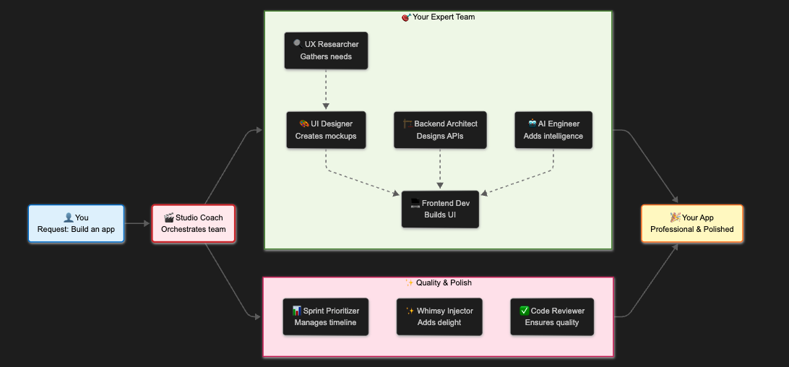
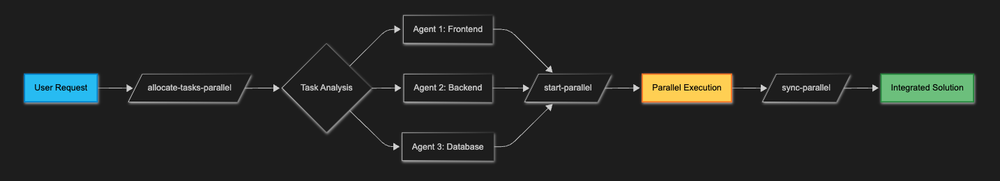

# 🚀 AI Agent Hub

<div align="center">
  
  ### ✨ Transform Claude into 9 Context-Aware AI Agents Working in Parallel ✨
  ### 🏃‍♂️ Build 79% Faster with Squad Mode + Full Session Memory 🏃‍♂️
  
  ```bash
  npx ai-agent-hub@latest
  ```
  
  **Works with Claude Desktop & Claude Code**
  
  [](https://www.npmjs.com/package/ai-agent-hub)
  [](package.json)
  [](package.json)
  [](README.md)
  [](LICENSE)
  
</div>

---

## 🚀 Quick Start

```bash
npx ai-agent-hub@latest
```

**One command, two simple questions:**
1. 📍 **Where to install?** → Project / Desktop / Both
2. ⚡ **Which mode?** → Classic (learning) / Squad (production)

**Then in Claude Code:**
```
"Build a viral TikTok app"
```
✨ Agents auto-activate based on your needs and share context automatically!

---

## ⚡ Squad Mode: Build 79% Faster

**Squad Mode** transforms Claude into a coordinated team that works in parallel, not sequentially.

### Visual Comparison

**Traditional (Sequential):**
```
Agent 1 works (30 min) → Agent 2 waits then works (30 min) → Agent 3 waits then works (30 min)
Total: 90 minutes
```

**Squad Mode (Parallel):**
```
Agent 1 works ┐
Agent 2 works ├─ All working simultaneously (30 min)
Agent 3 works ┘
Total: 30 minutes (66% faster!)
```

### Performance Gains
- **97% fewer tokens** - Slim, focused agents
- **66-79% faster** - Parallel execution
- **Smart coordination** - Automatic task distribution
- **Zero conflicts** - File-level mutex

### Parallel Commands in Claude Code

```markdown
# 1. Allocate Tasks
/allocate-tasks-parallel real-time dashboard with user analytics
# Analyzes and distributes to optimal agents (1-9)

# 2. Start Execution
/start-parallel
# Launches multiple agents simultaneously

# 3. Sync Progress
/sync-parallel
# Coordinates results and dependencies
```

### When to Use Each Mode

| **Classic Mode** | **Squad Mode** |
|-----------------|----------------|
| Learning agents | Production apps |
| Small tasks | Complex features |
| Exploration | Tight deadlines |

---

## 🧠 Context-Aware Collaboration (v3.4.0)

Agents now share context automatically, building on each other's work seamlessly:

### How It Works
```
1. First agent creates session → Writes decisions to .claude/context/
2. Next agent reads context → Knows what's done, continues work
3. All agents stay in sync → Real-time sharing, no duplicate effort
4. Next session continues → Picks up exactly where you left off
```

### Automatic Features
- **📝 Session Memory** - Work persists between Claude sessions
- **🔄 Shared Decisions** - All agents see what others decided
- **📚 Vocabulary Learning** - Adapts to your project's terminology
- **🎯 Smart Triggers** - Agents activate based on keywords

### Example Flow
```markdown
User: "Build an authentication system"
→ Backend Architect designs API, writes to context
→ Frontend Developer reads API specs, builds matching UI
→ AI Engineer sees both, adds biometric features
→ All decisions aligned automatically!
```

---

## 🎭 Your 9 Expert Agents

| Agent | Expertise | Use When You Need |
|-------|-----------|-------------------|
| 🎬 **Studio Coach** | Master orchestrator | Project coordination |
| 📊 **Sprint Prioritizer** | Agile planning | Sprint planning |
| 🔍 **UX Researcher** | User insights | Research, testing |
| 🎨 **Rapid UI Designer** | Fast prototyping | Mockups, UI/UX |
| 🏗️ **Backend System Architect** | System design | APIs, databases |
| 💻 **Frontend UI Developer** | UI implementation | React/Vue/Angular |
| 🤖 **AI/ML Engineer** | AI features | LLMs, ML pipelines |
| ✨ **Whimsy Injector** | Delight features | Creative touches |
| ✅ **Code Quality Reviewer** | Quality assurance | Code review |

---

## ⚙️ MCP Servers

Your Claude gets enhanced capabilities through MCP servers:

### Always Included
- **Memory** - Conversation history
- **Sequential Thinking** - Step-by-step reasoning
- **Context7** - Large project management
- **Playwright** - Browser automation
- **Browser MCP** - Web control (requires [extension](https://docs.browsermcp.io/setup-extension))

### Desktop-Specific
- **Filesystem** - File system access
- **GitHub** - Repository management

### Optional (with API Keys)
- **GitHub** (project) - `GITHUB_TOKEN`
- **Supabase** - `SUPABASE_ACCESS_TOKEN`
- **Postgres** - `POSTGRES_CONNECTION_STRING`
- **Brave Search** - `BRAVE_API_KEY`

---

## 📦 Installation

### Requirements
- Node.js 20+ ([Download](https://nodejs.org))
- Claude Desktop or Claude Code

### Interactive Install
```bash
npx ai-agent-hub@latest
```

### Advanced Options
```bash
# Skip prompts
npx ai-agent-hub@latest --project-only --mode squad
npx ai-agent-hub@latest --desktop-only --mode classic
npx ai-agent-hub@latest --both --mode auto
```

### What Gets Installed

**Project (.claude/)**
- 9 AI agents (Classic: full, Squad: slim)
- Context system (session persistence, shared decisions)
- Context triggers (keyword-based activation)
- MCP configuration
- Mode-specific instructions

**Claude Desktop**
- Enhanced config with 7 MCP servers
- Global agent availability
- Cross-project context awareness

---

## 🚀 How to Use

### Auto Mode (Default) - Just Describe What You Need
```markdown
"I need user authentication with social login"
# Backend Architect automatically handles API design
# Frontend Developer automatically creates UI
# Context shared between them instantly

"Make the loading screens more fun"
# Whimsy Injector automatically activates

"Build a real-time dashboard"
# Studio Coach coordinates multiple agents in parallel
```

### Explicit Commands (When You Want Control)
```markdown
"Use Studio Coach to plan my startup MVP"
"Have the Backend Architect design a scalable API"
"Get the UI Developer to create a responsive dashboard"
```



### Squad Mode Workflow



### Squad Mode Example
```markdown
# Step 1: Allocate
/allocate-tasks-parallel social media dashboard
# Output: "Optimal: 3 agents for frontend, backend, database"

# Step 2: Execute
/start-parallel
# Agents work simultaneously on different parts

# Step 3: Sync
/sync-parallel
# Coordinate and merge results
```

---

## 🔧 Configuration

### Environment Variables (Optional)
Create `.env` for additional features:

```bash
# MCP Servers
GITHUB_TOKEN=ghp_xxxxxxxxxxxx
SUPABASE_ACCESS_TOKEN=eyJxxxxxxxxx
POSTGRES_CONNECTION_STRING=postgresql://...
BRAVE_API_KEY=BSA-xxxxxxxxx

# AI Services
OPENAI_API_KEY=sk-xxxxxxxxx
ANTHROPIC_API_KEY=sk-ant-xxxxxx
GOOGLE_GENERATIVE_AI_API_KEY=AIzaxxxxxxxx
```

---

## 🛠️ Troubleshooting

| Problem | Solution |
|---------|----------|
| Agents not showing | Restart Claude |
| Command not found | Check Node.js 20+ |
| Browser MCP not working | Install [extension](https://docs.browsermcp.io/setup-extension) |
| Missing features | Add API keys to `.env` |

### Verify Installation
```bash
ls -la .claude/agents/           # Should show 9 agents
ls -la .claude/context/          # Should show session & shared-context files
cat .claude/context-triggers.md  # Should show keyword triggers
cat .mcp.json                    # Should show MCP config
```

---

## 🤝 Contributing

### Development
```bash
git clone https://github.com/ArieGoldkin/ai-agent-hub
cd ai-agent-hub
npm install
npm run build
```

### Before PR
```bash
npm run lint
npm run typecheck
npm run build
```

---

## 📄 License

MIT © 2024 AI Agent Hub

Created by [Arie Goldkin](https://github.com/ArieGoldkin)

---

<div align="center">
  
  ### 🌟 Ready to Supercharge Claude? 🌟
  
  ```bash
  npx ai-agent-hub@latest
  ```
  
  <sub>Built with ❤️ to make Claude extraordinary</sub>
  
  [⭐ Star](https://github.com/ArieGoldkin/ai-agent-hub) · 
  [🐛 Report Bug](https://github.com/ArieGoldkin/ai-agent-hub/issues) · 
  [💡 Request Feature](https://github.com/ArieGoldkin/ai-agent-hub/issues)
  
</div>