# 🚀 AI Agent Hub

<div align="center">
  
  ### ✨ Supercharge Claude with 9 AI Agents & MCP Servers in One Command ✨
  ### 🖥️ Works on macOS, Windows & Linux
  
  [](https://www.npmjs.com/package/ai-agent-hub)
  [](package.json)
  [](README.md)
  [](LICENSE)
  
  <p align="center">
    <strong>Transform Claude into a powerhouse with specialized AI personalities and enhanced capabilities</strong><br>
    <em>Compatible with macOS, Windows, and Linux</em>
  </p>
  
  ```bash
  npx ai-agent-hub@latest
  ```
  
  <sub>One command. Zero config. Instant superpowers. 🎯</sub>
  
</div>

---

## ⚡ **Quick Usage**

```bash
# 1. Install agents & servers (interactive)
npx ai-agent-hub@latest

# 2. Start using in Claude
"Use the ai-ml-engineer to implement this ML pipeline"

# 3. Start a collaborative session
npx ai-agent-hub@latest session start "my-project"

# 4. Analyze performance
npx ai-agent-hub@latest analyze
```

---

## 📋 Table of Contents

- [🎭 What You Get](#-what-you-get)
  - [🤖 9 Specialized AI Agent Personalities](#-9-specialized-ai-agent-personalities)
  - [⚙️ Powerful MCP Server Integration](#-powerful-mcp-server-integration)
- [🚀 Quick Start](#-quick-start)
  - [📦 Installation](#-installation-interactive-setup)
  - [🤔 Choose Where to Create Files](#-choose-where-to-create-files)
  - [🎯 What Happens Next](#-what-happens-next)
- [📚 Complete User Guide](#-complete-user-guide)
  - [🎮 Complete Command Reference](#-complete-command-reference)
- [🎯 Session Management Guide](#-session-management-guide)
  - [🚀 Starting Your First Session](#-starting-your-first-session)
  - [📊 Monitoring Session Progress](#-monitoring-session-progress)
  - [🔄 Session Lifecycle Management](#-session-lifecycle-management)
- [🤝 Agent Orchestration Workflow](#-agent-orchestration-workflow)
  - [🎭 How Agents Work Together](#-how-agents-work-together)
  - [🚀 Typical Workflow Example](#-typical-workflow-example-building-authentication)
- [📈 Analytics Features](#-analytics-features)
  - [🔍 Performance Analytics Dashboard](#-performance-analytics-dashboard)
  - [🎯 Specific Analytics Commands](#-specific-analytics-commands)
- [💡 Practical Examples](#-practical-examples)
  - [🚀 Real-World Usage Scenarios](#-real-world-usage-scenarios)
  - [🎯 Using AI Agents in Claude](#-using-ai-agents-in-claude)
- [📋 Session Templates](#-session-templates)
  - [🎨 Pre-built Workflow Templates](#-pre-built-workflow-templates)
  - [🔄 Template Customization](#-template-customization)
- [✅ Best Practices](#-best-practices)
  - [🎯 Session Management](#-session-management-best-practices)
  - [🤖 Agent Coordination](#-agent-coordination-best-practices)
  - [⚡ Performance Optimization](#-performance-optimization)
  - [🔐 Security & Environment](#-security--environment)
- [🔧 Configuration](#-configuration)
  - [🔐 Environment Variables](#-environment-variables)
  - [🎯 Context-Aware File Creation](#-context-aware-file-creation)
  - [🖥️ Cross-Platform Support](#-cross-platform-support)
- [🛠️ Troubleshooting](#-troubleshooting)
- [🌟 Features](#-features)
- [🧠 Context-Aware Agents](#-context-aware-agents)
- [🤝 Contributing](#-contributing)

---

## 🎭 What You Get

### 🤖 **9 Specialized AI Agent Personalities**

Transform Claude with expert agents, each with unique skills:

| Agent                           | Superpower                  | Perfect For                                |
| ------------------------------- | --------------------------- | ------------------------------------------ |
| 🧠 **ai-ml-engineer**           | AI/ML implementation expert | LLMs, computer vision, ML pipelines        |
| 🏗️ **backend-system-architect** | System design & scaling     | APIs, databases, microservices             |
| ✅ **code-quality-reviewer**    | Automated code review       | Best practices, testing, refactoring       |
| 💻 **frontend-ui-developer**    | React/Vue/Angular master    | Components, responsive design, performance |
| 🎨 **rapid-ui-designer**        | Lightning-fast prototyping  | Design systems, mockups, UI/UX             |
| 📊 **sprint-prioritizer**       | Agile planning wizard       | Sprint planning, feature prioritization    |
| 🎯 **studio-coach**             | Peak performance coach      | Team coordination, productivity            |
| 🔍 **ux-researcher**            | User insights specialist    | Research, testing, journey mapping         |
| ✨ **whimsy-injector**          | Creative enhancement        | Delightful experiences, memorable moments  |

### ⚙️ **Powerful MCP Server Integration**

Unlock Claude's full potential with these capabilities:

#### 📁 **Claude Code MCP Servers** (Created in `.mcp.json`)
These 5 servers are configured for your project:

| Server                     | Enhancement                    | Use Case                         |
| -------------------------- | ------------------------------ | -------------------------------- |
| 🧠 **memory**              | Persistent conversation memory | Remember context across sessions |
| 🤔 **sequential-thinking** | Step-by-step reasoning         | Complex problem solving          |
| 📚 **context7**            | Advanced context management    | Large-scale projects             |
| 🎭 **playwright**          | Browser automation             | Testing, web scraping            |
| 🗄️ **supabase**            | Database integration           | Direct DB operations             |

#### 🖥️ **Claude Desktop MCP Servers** (Global configuration)
All 7 servers, including the above 5 plus:

| Server                     | Enhancement                    | Use Case                            |
| -------------------------- | ------------------------------ | ----------------------------------- |
| 📁 **filesystem**          | File operations                | Local file management               |
| 🐙 **github**              | Repository access              | Code management across all projects |

<sub>💡 **Note:** Claude Code has native filesystem and GitHub support built-in, so these two are only needed for Claude Desktop</sub>

---

## 🚀 Quick Start

### 📦 **Installation (Interactive Setup!)**

> **💡 Important:** Always use `@latest` to ensure you get the correct version with all features!

```bash
# Run this command and choose your installation preference
npx ai-agent-hub@latest
```

**Interactive Setup** ✨ The tool will:

- 🎯 **Ask where you want to create files** (Claude Code, Claude Desktop, or Both)
- 🤖 Create 9 AI agent personalities where you choose
- ⚙️ Configure MCP servers based on your selection
- 📄 Set up all configuration files
- 🔐 Create environment templates (never overwrites existing `.env`)

### 🚀 **Non-Interactive Options**

For automation or when you know exactly what you want:

```bash
# Create files in current directory only
npx ai-agent-hub@latest --project-only

# Create files in Claude Desktop only 
npx ai-agent-hub@latest --desktop-only

# Create files in both locations
npx ai-agent-hub@latest --both
```

### 🤔 **Choose Where to Create Files**

When you run `npx ai-agent-hub@latest`, you'll see an interactive menu:

```
🤖 Where would you like to create AI Agent Hub files?

1. 🖥️  Claude Desktop
   → Create MCP servers globally in Claude Desktop configuration

2. 📁 Claude Code (in repo)
   → Create AI agents + MCP servers in current directory (.claude/agents/ + .mcp.json)

3. 🚀 Both
   → Create agents in repo + MCP servers in both repo and Claude Desktop

Please select an option (1-3):
```

### 🎯 **What Happens Next**

<details>
<summary><b>📁 In a Project Directory</b> (has `package.json` or `.git`)</summary>

```
✨ Installing AI Agent Hub...

🤖 AI Agent Personalities
   ✅ Installed 9 agents to .claude/agents/

⚙️  MCP Server Configuration
   ✅ Created .mcp.json with 5 servers
   ✅ Environment template created

🎉 Setup complete! Restart Claude to activate.
```

**Files created:**

```
your-project/
├── .claude/
│   ├── agents/           # 9 AI personalities
│   └── settings.local.json
├── .mcp.json            # MCP configuration
└── .env.example         # API key template
```

</details>

<details>
<summary><b>💻 With Claude Desktop</b></summary>

```
✨ Configuring Claude Desktop...

⚙️  Global Configuration
   ✅ Updated with 7 MCP servers
   ✅ All capabilities enabled

🎉 Setup complete! Restart Claude Desktop.
```

**Updates Claude Desktop config:**
- **macOS**: `~/Library/Application Support/Claude/claude_desktop_config.json`
- **Windows**: `%APPDATA%\Claude\claude_desktop_config.json`  
- **Linux**: `~/.config/Claude/claude_desktop_config.json`

</details>

<details>
<summary><b>🎮 Both Detected (Best Experience)</b></summary>

```
✨ Full Installation Mode

🤖 Project Setup
   ✅ Agents installed to .claude/agents/
   ✅ Created .mcp.json (5 servers)

💻 Desktop Setup
   ✅ Updated config (7 servers)

🎉 Maximum power unlocked!
```

</details>

---

## 📚 Complete User Guide

### 🎮 **Complete Command Reference**

#### **Core Setup Commands**

| Command                                     | Description                    | When to Use                    |
| ------------------------------------------- | ------------------------------ | ------------------------------ |
| `npx ai-agent-hub@latest`                   | **Interactive file creation**  | First time setup (recommended) |
| `npx ai-agent-hub@latest --project-only`    | Create files in repo only      | Working on specific project    |
| `npx ai-agent-hub@latest --desktop-only`    | Create files in Claude Desktop only | Global Claude enhancement      |
| `npx ai-agent-hub@latest --both`            | Create files in both locations | Maximum functionality          |
| `npx ai-agent-hub@latest --list-agents`     | View all 9 agents             | See available personalities    |
| `npx ai-agent-hub@latest --list`            | Show configured servers        | Check current setup            |
| `npx ai-agent-hub@latest <server>`          | Add specific server            | Need one capability            |
| `npx ai-agent-hub@latest --remove <server>` | Remove a server                | Cleanup unwanted servers       |
| `npx ai-agent-hub@latest --help`            | Display help                   | See all commands               |

#### **Session Management Commands**

| Command                                     | Description                    | When to Use                    |
| ------------------------------------------- | ------------------------------ | ------------------------------ |
| `npx ai-agent-hub@latest session start [name]` | Start new collaborative session | Beginning multi-agent workflow |
| `npx ai-agent-hub@latest session show`      | Display current session status | Check active session details   |
| `npx ai-agent-hub@latest session clear`     | Archive and clear session     | Clean slate for new work       |
| `npx ai-agent-hub@latest session list`      | View last 5 archived sessions | Review past collaboration      |
| `npx ai-agent-hub@latest session help`      | Session command help          | Learn session features         |

#### **Analytics & Performance Commands**

| Command                                     | Description                    | When to Use                    |
| ------------------------------------------- | ------------------------------ | ------------------------------ |
| `npx ai-agent-hub@latest analyze`           | Full workflow analysis        | Complete performance overview   |
| `npx ai-agent-hub@latest analyze performance` | Agent performance metrics     | Check agent efficiency         |
| `npx ai-agent-hub@latest analyze handoffs`  | Handoff pattern analysis      | Optimize agent collaboration   |
| `npx ai-agent-hub@latest analyze bottlenecks` | Detect workflow slowdowns     | Find and fix workflow issues   |
| `npx ai-agent-hub@latest analyze insights`  | Get optimization suggestions  | Improve workflow performance   |
| `npx ai-agent-hub@latest analyze growth`    | Context accumulation analysis | Track information flow         |
| `npx ai-agent-hub@latest analyze quality`   | Decision quality tracking     | Measure decision effectiveness  |

---

## 🎯 Session Management Guide

### 🚀 **Starting Your First Session**

```bash
# Start a named session for your project
npx ai-agent-hub@latest session start "auth-system"

# Or start an unnamed session (auto-generates ID)
npx ai-agent-hub@latest session start
```

### 📊 **Monitoring Session Progress**

```bash
# View current session details
npx ai-agent-hub@latest session show
```

Output example:
```
📋 Current Session: auth-system-2024
⏱️  Started: 2024-01-15 14:30:00
🤖 Active Agents: 3 (ux-researcher, backend-system-architect, studio-coach)
📈 Context Items: 15
🔄 Handoffs: 4
```

### 🔄 **Session Lifecycle Management**

```bash
# Archive current session and start fresh
npx ai-agent-hub@latest session clear

# View recent sessions
npx ai-agent-hub@latest session list
```

---

## 🤝 Agent Orchestration Workflow

### 🎭 **How Agents Work Together**

AI Agent Hub's agents collaborate through intelligent context sharing:

```mermaid
graph TD
    A[🎯 Studio Coach] --> B[🔍 UX Researcher]
    A --> C[📊 Sprint Prioritizer]
    B --> D[🏗️ Backend Architect]
    C --> D
    D --> E[💻 Frontend Developer]
    D --> F[🧠 AI/ML Engineer]
    E --> G[✅ Code Quality Reviewer]
    F --> G
    G --> H[✨ Whimsy Injector]
    H --> I[🎨 UI Designer]
```



### 🚀 **Typical Workflow Example: Building Authentication**

1. **🎯 Studio Coach** orchestrates the workflow:
   ```
   "Let's build a secure authentication system. I'll coordinate with our specialists."
   ```

2. **🔍 UX Researcher** gathers requirements:
   ```json
   {
     "user_needs": ["social login", "2FA", "password reset"],
     "pain_points": ["complex signup", "forgotten passwords"],
     "success_metrics": ["<30s signup", "<5% drop-off"]
   }
   ```

3. **🏗️ Backend Architect** designs the system:
   ```json
   {
     "api_endpoints": ["/auth/login", "/auth/register", "/auth/refresh"],
     "database_schema": "users, sessions, oauth_providers",
     "security_features": ["JWT tokens", "rate limiting", "CSRF protection"]
   }
   ```

4. **💻 Frontend Developer** implements UI:
   ```json
   {
     "components": ["LoginForm", "SignupWizard", "TwoFactorSetup"],
     "state_management": "auth context + secure storage",
     "user_flows": ["seamless social login", "progressive signup"]
   }
   ```

5. **✅ Code Quality Reviewer** validates:
   ```json
   {
     "security_audit": "passed",
     "test_coverage": "94%",
     "performance": "A+ rating",
     "accessibility": "WCAG 2.1 AA compliant"
   }
   ```

6. **✨ Whimsy Injector** adds delight:
   ```json
   {
     "micro_interactions": ["success animations", "smooth transitions"],
     "personality": "friendly error messages",
     "memorable_moments": ["welcome celebration", "achievement badges"]
   }
   ```

---

## 📈 Analytics Features

### 🔍 **Performance Analytics Dashboard**

```bash
# Get complete workflow analysis
npx ai-agent-hub@latest analyze
```

Sample output:
```
📊 Workflow Performance Analysis

🤖 Agent Performance:
   ├─ 🎯 studio-coach         │ ████████████████████ │ 95% efficiency │ 2.3s avg
   ├─ 🔍 ux-researcher        │ ██████████████████   │ 89% efficiency │ 4.1s avg
   ├─ 🏗️ backend-architect    │ ████████████████████ │ 92% efficiency │ 3.7s avg
   ├─ 💻 frontend-developer   │ ███████████████████  │ 91% efficiency │ 3.2s avg
   └─ ✅ code-quality-reviewer│ ████████████████████ │ 97% efficiency │ 1.8s avg

🔄 Handoff Analysis:
   ├─ Successful handoffs: 12/13 (92%)
   ├─ Average handoff time: 1.2s
   └─ Context preservation: 98%

⚡ Bottleneck Detection:
   └─ No significant bottlenecks detected

💡 Optimization Insights:
   ├─ UX Researcher could benefit from design system templates
   └─ Consider parallel execution for frontend/backend work
```

### 🎯 **Specific Analytics Commands**

#### **Performance Metrics**
```bash
npx ai-agent-hub@latest analyze performance
```

#### **Handoff Pattern Analysis**
```bash
npx ai-agent-hub@latest analyze handoffs
```

#### **Bottleneck Detection**
```bash
npx ai-agent-hub@latest analyze bottlenecks
```

#### **Optimization Insights**
```bash
npx ai-agent-hub@latest analyze insights
```

---

## 💡 Practical Examples

### 🚀 **Real-World Usage Scenarios**

#### **Scenario 1: Building a SaaS Dashboard**

```bash
# 1. Start project session
npx ai-agent-hub@latest session start "saas-dashboard"

# 2. In Claude, orchestrate the workflow
"Use the studio-coach to coordinate building a SaaS analytics dashboard"

# 3. Monitor progress
npx ai-agent-hub@latest session show

# 4. Analyze performance when done
npx ai-agent-hub@latest analyze
```

#### **Scenario 2: Code Review & Optimization**

```bash
# Start review session
npx ai-agent-hub@latest session start "code-review"

# In Claude:
"Have the code-quality-reviewer audit this React component, then get optimization suggestions from the frontend-developer"

# Check handoff patterns
npx ai-agent-hub@latest analyze handoffs
```

#### **Scenario 3: Sprint Planning**

```bash
# Planning session
npx ai-agent-hub@latest session start "sprint-planning-q1"

# In Claude:
"Use sprint-prioritizer to help plan our Q1 features based on these user stories"

# View session insights
npx ai-agent-hub@latest analyze insights
```

### 🎯 **Using AI Agents in Claude**

Once installed, simply ask Claude to use specific agents:

```markdown
# Single agent requests
"Use the ai-ml-engineer agent to implement this RAG system"
"Have the sprint-prioritizer help plan our next sprint"  
"Get the code-quality-reviewer to audit this PR"
"Ask the whimsy-injector to make this UI delightful"

# Multi-agent orchestration
"Use the studio-coach to coordinate a full authentication system build"
"Have the ux-researcher gather requirements, then pass to backend-architect"
```

### ⚡ **Quick Server Management**

```bash
# Add specific capabilities
npx ai-agent-hub@latest memory          # Add conversation memory
npx ai-agent-hub@latest playwright      # Add browser automation
npx ai-agent-hub@latest supabase        # Add database access

# Remove unwanted servers
npx ai-agent-hub@latest --remove docker

# Check what's configured
npx ai-agent-hub@latest --list
```

---

## 📋 Session Templates

### 🎨 **Pre-built Workflow Templates**

Common session patterns you can start with:

#### **Full-Stack Development Template**

```bash
npx ai-agent-hub@latest session start "fullstack-build"

# Then in Claude:
"Studio-coach: Let's build a [feature] using our full development pipeline"
```

**Expected Flow:**
1. Studio Coach → orchestrates
2. UX Researcher → user requirements  
3. Sprint Prioritizer → feature priority
4. Backend Architect → API design
5. Frontend Developer → UI implementation
6. Code Quality Reviewer → validation
7. Whimsy Injector → enhancement

#### **Code Review Template**

```bash
npx ai-agent-hub@latest session start "code-review"

# Then in Claude:
"Code-quality-reviewer: Please audit this code, then coordinate with relevant specialists for improvements"
```

#### **Design System Template**

```bash
npx ai-agent-hub@latest session start "design-system"

# Then in Claude:
"Rapid-UI-designer: Create a design system, then coordinate with frontend-developer for implementation"
```

#### **ML Pipeline Template**

```bash
npx ai-agent-hub@latest session start "ml-pipeline"

# Then in Claude:
"AI-ML-engineer: Design and implement this ML feature, coordinate with backend-architect for API integration"
```

### 🔄 **Template Customization**

You can customize workflows by:
- Starting with base templates
- Adding specific agent instructions
- Monitoring with session analytics
- Optimizing based on insights

---

## ✅ Best Practices

### 🎯 **Session Management Best Practices**

1. **📝 Name Your Sessions Meaningfully**
   ```bash
   # Good
   npx ai-agent-hub@latest session start "user-auth-system"
   npx ai-agent-hub@latest session start "homepage-redesign"
   
   # Not ideal
   npx ai-agent-hub@latest session start "test"
   npx ai-agent-hub@latest session start "stuff"
   ```

2. **🔄 Clear Sessions Regularly**
   ```bash
   # Archive completed work
   npx ai-agent-hub@latest session clear
   
   # Start fresh for new projects
   npx ai-agent-hub@latest session start "next-project"
   ```

3. **📊 Monitor Performance**
   ```bash
   # Check progress regularly
   npx ai-agent-hub@latest session show
   
   # Analyze at project completion
   npx ai-agent-hub@latest analyze
   ```

### 🤖 **Agent Coordination Best Practices**

1. **🎭 Start with Studio Coach**
   ```markdown
   "Studio-coach: Help me build [feature] using our agent team"
   ```

2. **📋 Be Specific with Context**
   ```markdown
   # Good - provides clear context
   "UX-researcher: Research user needs for a mobile-first e-commerce checkout flow targeting Gen Z users"
   
   # Less effective - too vague
   "UX-researcher: Do some research"
   ```

3. **🔄 Leverage Agent Handoffs**
   ```markdown
   "Have the ux-researcher gather requirements, then hand off to backend-architect for API design"
   ```

### ⚡ **Performance Optimization**

1. **📈 Use Analytics for Insights**
   ```bash
   # Find bottlenecks
   npx ai-agent-hub@latest analyze bottlenecks
   
   # Get optimization suggestions
   npx ai-agent-hub@latest analyze insights
   ```

2. **🔄 Optimize Handoff Patterns**
   ```bash
   # Review handoff efficiency
   npx ai-agent-hub@latest analyze handoffs
   ```

3. **🎯 Focus Context on Relevant Agents**
   - Don't overwhelm agents with irrelevant context
   - Use specific agent expertise for targeted tasks
   - Let Studio Coach coordinate complex workflows

### 🔐 **Security & Environment**

1. **🔑 Secure Your API Keys**
   ```bash
   # Copy template and add keys
   cp .env.example .env
   
   # Never commit .env to version control
   echo ".env" >> .gitignore
   ```

2. **🔍 Review Server Permissions**
   ```bash
   # Check configured servers
   npx ai-agent-hub@latest --list
   
   # Remove unused servers
   npx ai-agent-hub@latest --remove <server-name>
   ```

---

## 🔧 Configuration

### 🔐 **Environment Variables**

Some MCP servers need API keys. The tool:

- ✅ **Never overwrites** existing `.env` files
- 📋 Creates `.env.example` as a template
- 🔍 Reports missing variables clearly
- 📝 Provides setup instructions

<details>
<summary><b>Required API Keys</b></summary>

| Variable                | Required For    | How to Get                                         |
| ----------------------- | --------------- | -------------------------------------------------- |
| `GITHUB_TOKEN`          | GitHub server   | [Create token](https://github.com/settings/tokens) |
| `SUPABASE_ACCESS_TOKEN` | Supabase server | [Get from dashboard](https://app.supabase.com)     |
| `SUPABASE_PROJECT_REF`  | Supabase server | Your project reference                             |
| `BRAVE_API_KEY`         | Brave search    | [Get API key](https://brave.com/search/api/)       |

</details>

### 🎯 **Context-Aware File Creation**

The tool intelligently adapts to your environment:

| Environment               | What Gets Created                   | Details                                                |
| ------------------------- | ----------------------------------- | ------------------------------------------------------ |
| **Claude Code (in repo)** | • 9 AI agents<br>• 5 MCP servers   | `.claude/agents/` + `.mcp.json`<br>Excludes filesystem/github (native support) |
| **Claude Desktop Only**   | • 7 MCP servers globally           | All servers including filesystem & github             |
| **Both**                  | • 9 AI agents<br>• All MCP servers | Agents in repo + 5 servers in `.mcp.json`<br>+ 7 servers in Claude Desktop |

### 🖥️ **Cross-Platform Support**

AI Agent Hub automatically detects your operating system and uses the correct Claude Desktop configuration paths:

| Operating System | Claude Desktop Config Path |
|------------------|----------------------------|
| **macOS** | `~/Library/Application Support/Claude/claude_desktop_config.json` |
| **Windows** | `%APPDATA%\Claude\claude_desktop_config.json` |
| **Linux** | `~/.config/Claude/claude_desktop_config.json` |

The tool works identically across all platforms - no OS-specific commands needed!

---

## 🛠️ Troubleshooting

### 🚨 **Common Issues & Solutions**

<details>
<summary><b>💭 "Command not found" or "npx: command not found"</b></summary>

**Cause:** Node.js is not installed or not in PATH

**Solution:**
1. Install Node.js (version 16 or higher):
   ```bash
   # Check if installed
   node --version  # Should be 16+
   npm --version   # Should be 6+
   ```

2. If not installed, visit [nodejs.org](https://nodejs.org/) or use package manager:
   ```bash
   # macOS (using Homebrew)
   brew install node
   
   # Windows (using Chocolatey)
   choco install nodejs
   
   # Linux (Ubuntu/Debian)
   sudo apt-get install nodejs npm
   ```

3. Restart terminal and try again

</details>

<details>
<summary><b>🔄 "Agents not showing in Claude"</b></summary>

**Cause:** Claude hasn't loaded the agent configuration or agents aren't in the right location

**Solutions:**
1. **Restart Claude completely:**
   - Claude Desktop: Quit and restart
   - Claude Code: Reload VS Code window

2. **Verify agent installation:**
   ```bash
   # Check if agents were created
   ls -la .claude/agents/
   
   # Verify configuration file
   cat .claude/settings.local.json
   ```

3. **Check agent directory path:**
   - Ensure `.claude/settings.local.json` has correct `"directory": "./agents"`
   - Agents should be in `.claude/agents/` not just `agents/`

4. **Manual verification:**
   ```bash
   # Should show 9 agent files
   ls .claude/agents/*.md | wc -l
   ```

</details>

<details>
<summary><b>⚠️ "Missing environment variables" or MCP servers failing</b></summary>

**Cause:** Required API keys are not configured

**Solutions:**
1. **Create `.env` from template:**
   ```bash
   # Copy template (if .env doesn't exist)
   cp .env.example .env
   
   # Edit with your keys
   nano .env  # or your preferred editor
   ```

2. **Get required API keys:**
   - `GITHUB_TOKEN`: [GitHub Personal Access Tokens](https://github.com/settings/tokens)
   - `SUPABASE_ACCESS_TOKEN`: [Supabase Dashboard](https://app.supabase.com)
   - `BRAVE_API_KEY`: [Brave Search API](https://brave.com/search/api/)

3. **Check current environment:**
   ```bash
   # See which variables are missing
   npx ai-agent-hub@latest --list
   ```

4. **Verify configuration:**
   ```bash
   # Check if .env is loaded (don't show values)
   env | grep -E "(GITHUB|SUPABASE|BRAVE)" | wc -l
   ```

</details>

<details>
<summary><b>🚫 "No Claude installation detected"</b></summary>

**Cause:** Tool can't find Claude Desktop or project isn't recognized

**Solutions:**
1. **For Claude Desktop setup:**
   - Install [Claude Desktop](https://claude.ai/download)
   - Ensure it's installed in standard location:
     - macOS: `/Applications/Claude.app`
     - Windows: Standard Program Files location
     - Linux: Standard application directory

2. **For project setup:**
   ```bash
   # Make sure you're in a project directory
   pwd
   
   # Should have one of these:
   ls package.json  # Node.js project
   ls .git          # Git repository
   ls pyproject.toml # Python project
   ```

3. **Force project mode:**
   ```bash
   # Create a basic package.json if needed
   echo '{"name": "my-project"}' > package.json
   
   # Then run AI Agent Hub
   npx ai-agent-hub@latest
   ```

</details>

<details>
<summary><b>🔐 "Permission denied" errors</b></summary>

**Cause:** Insufficient permissions to write files

**Solutions:**
1. **Check directory permissions:**
   ```bash
   # Check current directory
   ls -la
   
   # Check home directory permissions (for Claude Desktop)
   ls -la ~
   ```

2. **Fix permissions:**
   ```bash
   # For current directory
   chmod 755 .
   
   # For Claude Desktop config (macOS)
   mkdir -p ~/Library/Application\ Support/Claude
   chmod 755 ~/Library/Application\ Support/Claude
   ```

3. **Run without sudo:**
   - Never use `sudo` with npm/npx commands
   - Use Node Version Managers (nvm) for user-level Node.js

</details>

<details>
<summary><b>📁 "File already exists" warnings</b></summary>

**Cause:** Previous installation or conflicting files

**Solutions:**
1. **Safe to ignore:** AI Agent Hub never overwrites files without permission

2. **Check what exists:**
   ```bash
   # See what's already there
   ls .claude/
   ls .mcp.json
   ls .env
   ```

3. **Clean reinstall if needed:**
   ```bash
   # Backup existing config
   mv .claude .claude.backup
   mv .mcp.json .mcp.json.backup
   
   # Fresh install
   npx ai-agent-hub@latest
   
   # Restore custom settings if needed
   ```

</details>

<details>
<summary><b>🐌 "npx is taking forever" or download issues</b></summary>

**Cause:** Network issues or npm cache problems

**Solutions:**
1. **Clear npm cache:**
   ```bash
   npm cache clean --force
   ```

2. **Use specific registry:**
   ```bash
   npx --registry=https://registry.npmjs.org/ ai-agent-hub@latest
   ```

3. **Check network connection:**
   ```bash
   # Test npm connectivity
   npm ping
   ```

4. **Use latest version explicitly:**
   ```bash
   npx ai-agent-hub@latest  # Always use @latest
   ```

</details>

<details>
<summary><b>🔄 "Sessions not working" or context issues</b></summary>

**Cause:** Session files corrupted or permission issues

**Solutions:**
1. **Check session files:**
   ```bash
   # View current session
   cat .claude/session-context.json
   
   # View archived sessions
   cat .claude/session-archive.json
   ```

2. **Reset session system:**
   ```bash
   # Clear current session
   npx ai-agent-hub@latest session clear
   
   # Or manually reset
   rm .claude/session-context.json
   rm .claude/session-archive.json
   ```

3. **Verify session commands:**
   ```bash
   # Test session system
   npx ai-agent-hub@latest session help
   ```

</details>

<details>
<summary><b>🖥️ "Different behavior on Windows/Linux"</b></summary>

**Cause:** Path or line ending differences

**Solutions:**
1. **Use consistent commands:**
   ```bash
   # These work on all platforms
   npx ai-agent-hub@latest
   npx ai-agent-hub@latest session start
   npx ai-agent-hub@latest analyze
   ```

2. **Check Claude Desktop paths:**
   - Windows: `%APPDATA%\Claude\claude_desktop_config.json`
   - Linux: `~/.config/Claude/claude_desktop_config.json`
   - macOS: `~/Library/Application Support/Claude/claude_desktop_config.json`

3. **Line endings (if contributing):**
   ```bash
   git config --global core.autocrlf true  # Windows
   git config --global core.autocrlf input # Linux/macOS
   ```

</details>

### 🆘 **Still Having Issues?**

If none of the above solutions work:

1. **Gather diagnostic info:**
   ```bash
   # System info
   node --version
   npm --version
   echo $OS || echo $OSTYPE
   
   # AI Agent Hub info
   npx ai-agent-hub@latest --version
   npx ai-agent-hub@latest --help
   
   # Check installation
   ls -la .claude/
   ls -la .mcp.json
   ```

2. **Create minimal test case:**
   ```bash
   mkdir test-ai-agent-hub
   cd test-ai-agent-hub
   echo '{"name": "test"}' > package.json
   npx ai-agent-hub@latest --project-only
   ```

3. **Report the issue:**
   - Go to [GitHub Issues](https://github.com/ArieGoldkin/ai-agent-hub/issues)
   - Include your diagnostic info
   - Describe what you expected vs. what happened
   - Mention your OS and Node.js version

---

## 🌟 Features

### ✨ **Why AI Agent Hub?**

- **🚀 Zero Dependencies** - Installs instantly, no bloat
- **🎯 One Command** - No complex setup or configuration
- **🧠 Smart Detection** - Adapts to your environment automatically
- **🔒 Safe Operations** - Never overwrites your files
- **📦 No Installation** - Works directly with npx
- **🖥️ Cross-Platform** - Works on macOS, Windows, and Linux
- **🎭 9 Expert Agents** - Specialized personalities for every task
- **⚙️ 7+ MCP Servers** - Enhanced capabilities out of the box

### 🏆 **Perfect For**

- 👨‍💻 **Developers** wanting Claude superpowers instantly
- 🚀 **Teams** needing consistent AI assistance
- 🎨 **Designers** leveraging AI for rapid prototyping
- 📊 **Product Managers** planning sprints with AI
- 🔬 **Researchers** needing specialized AI expertise

---

## 🧠 Context-Aware Agents

### 🔄 **Intelligent Agent Collaboration**

All 9 AI agents now work together through a sophisticated context management system:

- **📊 Session Management**: Track agent collaboration across tasks
- **🤝 Smart Handoffs**: Agents automatically pass context to the right specialist
- **📈 Performance Analytics**: Measure and optimize agent workflows with modular analyzers
- **🎯 Context Flow**: Information accumulates as agents work together
- **🏗️ Modular Architecture**: Clean, maintainable code with focused modules under 80 lines

### 📍 **Session Commands**

Manage your agent collaboration sessions:

```bash
# Session management
ai-agent-hub session start [name]  # Start new collaborative session
ai-agent-hub session show          # Display current session status
ai-agent-hub session clear         # Archive and clear current session
ai-agent-hub session list          # View recent sessions

# Performance analytics
ai-agent-hub analyze               # Full workflow analysis
ai-agent-hub analyze performance   # Agent performance metrics
ai-agent-hub analyze handoffs      # Handoff pattern analysis
ai-agent-hub analyze bottlenecks   # Detect workflow slowdowns
ai-agent-hub analyze insights      # Get optimization suggestions
```

### 🌊 **Example Workflow**

Here's how agents collaborate on building an authentication system:

1. **🎯 Studio Coach** orchestrates the workflow
2. **🔍 UX Researcher** gathers user requirements
3. **🏗️ Backend Architect** designs API and database
4. **💻 Frontend Developer** implements UI components
5. **✅ Code Quality Reviewer** validates everything
6. **✨ Whimsy Injector** adds delightful touches
7. **📊 Analytics** provides performance insights

Each agent reads context from previous agents and adds their own, creating a comprehensive solution with full traceability.

## 🤝 Contributing

We love contributions! Here's how to help:

### 🆕 **Add a New MCP Server**

1. Edit `lib/mcp-templates.ts`
2. Add server configuration
3. Test: `npm run build && node dist/bin/cli.js`
4. Submit PR with description

### 🤖 **Create a New Agent**

1. Add `.md` file to `agents/`
2. Follow existing format with frontmatter
3. Test installation locally
4. Submit PR with use cases

### 🐛 **Report Issues**

Found a bug? [Open an issue](https://github.com/ArieGoldkin/ai-agent-hub/issues) with:

- Your environment (OS, Claude version)
- Command that failed
- Error message
- Expected behavior

---

## 📄 License

MIT © 2024 AI Agent Hub

---

<div align="center">
  
  ### 🌟 **Ready to Supercharge Claude?** 🌟
  
  ```bash
  npx ai-agent-hub@latest
  ```
  
  <sub>Built with ❤️ to make Claude even more powerful</sub>
  
  [Report Bug](https://github.com/ArieGoldkin/ai-agent-hub/issues) · [Request Feature](https://github.com/ArieGoldkin/ai-agent-hub/issues) · [Star on GitHub](https://github.com/ArieGoldkin/ai-agent-hub)
  
</div>
