# 🚀 AI Agent Hub

<div align="center">
  
  ### ✨ Transform Claude into 9 Specialized AI Agents in One Command ✨
  
  [](https://www.npmjs.com/package/ai-agent-hub)
  [](package.json)
  [](package.json)
  [](README.md)
  [](LICENSE)
  
</div>

---

## ⚡ Try It Now (30 seconds)

```bash
# Install with one command
npx ai-agent-hub@latest

# Then ask Claude:
"Use Studio Coach to help me build a viral TikTok app"
```

**That's it!** Claude now has 9 expert agents ready to help.

---

## 🎯 Why AI Agent Hub?

**Before:** Claude is a generalist - great at everything, master of none.

**After:** Claude becomes a team of 9 specialists working together:
- **Studio Coach** orchestrates your entire project
- **Sprint Prioritizer** keeps you focused on what matters
- **Backend Architect** designs scalable systems
- **Frontend Developer** builds beautiful UIs
- **AI/ML Engineer** implements intelligent features
- And 4 more specialized experts...

### Real Example:
```markdown
You: "Help me build a dashboard for tracking user metrics"

Claude (with AI Agent Hub):
1. Studio Coach coordinates the project
2. UX Researcher analyzes user needs
3. Rapid UI Designer creates mockups
4. Backend Architect designs the API
5. Frontend Developer implements the UI
6. Code Quality Reviewer ensures excellence
```

---

## 🎭 Your 9 Expert Agents

| Agent | Expertise | Use When You Need |
|-------|-----------|-------------------|
| 🎬 **Studio Coach** | Master orchestrator | Project coordination, team alignment |
| 📊 **Sprint Prioritizer** | Agile planning | Sprint planning, feature prioritization |
| 🔍 **UX Researcher** | User insights | Research, testing, journey mapping |
| 🎨 **Rapid UI Designer** | Fast prototyping | Mockups, design systems, UI/UX |
| 🏗️ **Backend System Architect** | System design | APIs, databases, microservices |
| 💻 **Frontend UI Developer** | UI implementation | React/Vue/Angular components |
| 🤖 **AI/ML Engineer** | AI features | LLMs, computer vision, ML pipelines |
| ✨ **Whimsy Injector** | Delight features | Memorable UX, creative touches |
| ✅ **Code Quality Reviewer** | Quality assurance | Code review, testing, best practices |

---

## ⚙️ Enhanced with MCP Servers

Your Claude gets superpowers through MCP (Model Context Protocol) servers:

### Always Included:
| Server | What It Does | Example Use |
|--------|--------------|-------------|
| 🧠 **Memory** | Remembers conversations | "Remember this API design for later" |
| 🤔 **Sequential Thinking** | Step-by-step reasoning | Complex problem solving |
| 📚 **Context7** | Manages large contexts | Multi-file projects |
| 🎭 **Playwright** | Browser automation | Testing, web scraping |
| 🌐 **Browser MCP*** | Browser control | Web navigation, form filling |

> **🌐 Browser MCP Setup:**
> 1. Install extension: https://docs.browsermcp.io/setup-extension
> 2. In Claude, type `/mcp` to connect
> 3. Now Claude can browse the web!

### Desktop-Specific Servers:
When installing to Claude Desktop, you also get:
- **Filesystem** - Read-only file system access
- **GitHub** - Repository management (always included)

### Optional Servers (Activate with API Keys):
| Server | Required Variable | Purpose |
|--------|------------------|---------|
| **GitHub** (project) | `GITHUB_TOKEN` | Repository management |
| **Supabase** | `SUPABASE_ACCESS_TOKEN` | Database access |
| **Postgres** | `POSTGRES_CONNECTION_STRING` | Direct SQL access |
| **Brave Search** | `BRAVE_API_KEY` | Web search capabilities |

---

## 📦 Installation

### Requirements
- Node.js 20+ ([Download](https://nodejs.org))
- Claude Desktop or Claude Code

### Quick Install (Recommended)
```bash
npx ai-agent-hub@latest
```
Choose where to install:
1. **Project only** - Just for current project
2. **Desktop only** - Available globally
3. **Both** - Maximum flexibility

### Advanced Options
```bash
# Skip prompts, install to project
npx ai-agent-hub@latest --project-only

# Install globally to Claude Desktop
npx ai-agent-hub@latest --desktop-only

# Install to both locations
npx ai-agent-hub@latest --both
```

### Smart Installation Behavior
- **New Project**: Installs all 9 agents fresh
- **Existing .claude**: 
  - ✅ Preserves your custom agents
  - ✅ Adds only missing hub agents
  - ✅ Never overwrites your work
  - ✅ Reports what was added vs preserved

---

## 🚀 How to Use

### Basic Usage
```markdown
"Use Studio Coach to plan my startup MVP"
"Have the Backend Architect design a scalable API"
"Get the UI Developer to create a responsive dashboard"
```

### Advanced Orchestration
```markdown
"Studio Coach, coordinate the team to build a social media app:
- UX Researcher should identify user needs
- UI Designer creates the interface
- Backend Architect designs the API
- Frontend Developer implements it
- Quality Reviewer ensures it's production-ready"
```

### How Agents Collaborate

```mermaid
flowchart LR
    You("👤 You<br/>Request: Build an app") 
    Coach("🎬 Studio Coach<br/>Orchestrates team")
    
    subgraph Team[" 🎯 Your Expert Team "]
        Research("🔍 UX Researcher<br/>Gathers needs")
        Design("🎨 UI Designer<br/>Creates mockups")
        Backend("🏗️ Backend Architect<br/>Designs APIs")
        Frontend("💻 Frontend Dev<br/>Builds UI")
        AI("🤖 AI Engineer<br/>Adds intelligence")
    end
    
    subgraph Support[" ✨ Quality & Polish "]
        Sprint("📊 Sprint Prioritizer<br/>Manages timeline")
        Whimsy("✨ Whimsy Injector<br/>Adds delight")
        Review("✅ Code Reviewer<br/>Ensures quality")
    end
    
    Result("🎉 Your App<br/>Professional & Polished")
    
    You --> Coach
    Coach --> Team
    Coach --> Support
    Team --> Result
    Support --> Result
    
    Research -.-> Design
    Design -.-> Frontend
    Backend -.-> Frontend
    AI -.-> Frontend
    
    style You fill:#e3f2fd,stroke:#1976d2,stroke-width:2px,color:#000
    style Coach fill:#ffebee,stroke:#c62828,stroke-width:3px,color:#000
    style Result fill:#fff9c4,stroke:#f57c00,stroke-width:2px,color:#000
    style Team fill:#f1f8e9,stroke:#558b2f,stroke-width:2px,color:#000
    style Support fill:#fce4ec,stroke:#c2185b,stroke-width:2px,color:#000
    
    linkStyle default stroke:#666,stroke-width:2px,fill:none
    linkStyle 5,6,7,8 stroke:#888,stroke-width:2px,fill:none,stroke-dasharray: 5 5
```



**The Flow Explained:**
1. **You** make a request (e.g., "Build a dashboard")
2. **Studio Coach** understands and coordinates the entire team
3. **Expert Team** works in parallel:
   - UX Researcher discovers what users need
   - UI Designer creates beautiful interfaces
   - Backend Architect designs robust systems
   - Frontend Developer implements everything
   - AI Engineer adds smart features
4. **Support Team** ensures excellence:
   - Sprint Prioritizer keeps everything on track
   - Whimsy Injector adds delightful touches
   - Code Reviewer maintains quality standards
5. **Result**: You get a professional, polished application

Agents share context seamlessly (dotted lines) - you just see the magic happen!

---

## 📁 What Gets Installed

### In Your Project (.claude/)
```
.claude/
├── agents/              # 9 AI agent personalities
└── settings.local.json  # Claude Code settings
.mcp.json               # MCP server configuration
.env                    # API keys (optional)
CLAUDE.md              # Agent documentation
```

### In Claude Desktop
```
claude_desktop_config.json  # Enhanced with 7 MCP servers:
                            # Base: memory, sequential-thinking, context7, 
                            #       playwright, browsermcp
                            # Plus: filesystem, github
```

### Installation Locations
- **macOS**: `~/Library/Application Support/Claude/`
- **Windows**: `%APPDATA%\Claude\`
- **Linux**: `~/.config/Claude/`

---

## 🔧 Configuration

### Environment Variables (Optional)
Create a `.env` file to enable additional features:

```bash
cp .env.example .env
```

#### Available Integrations:

| Category | Variable | Purpose | Example |
|----------|----------|---------|---------|
| **MCP Servers** | | | |
| GitHub | `GITHUB_TOKEN` | Repository access | `ghp_xxxxxxxxxxxx` |
| Supabase* | `SUPABASE_ACCESS_TOKEN` | Database access | `eyJxxxxxxxxx` |
| Postgres | `POSTGRES_CONNECTION_STRING` | Direct SQL | `postgresql://...` |
| Brave Search | `BRAVE_API_KEY` | Web search | `BSA-xxxxxxxxx` |
| **AI Services** | | | |
| OpenAI | `OPENAI_API_KEY` | GPT models | `sk-xxxxxxxxx` |
| Anthropic | `ANTHROPIC_API_KEY` | Claude API | `sk-ant-xxxxxx` |
| Google AI | `GOOGLE_GENERATIVE_AI_API_KEY` | Gemini models | `AIzaxxxxxxxx` |
| **Advanced** | | | |
| Filesystem | `FILESYSTEM_ROOT` | Allowed directory | `/path/to/dir` |
| Memory | `MEMORY_BACKEND` | Storage type | `sqlite` |
| Docker | `DOCKER_SOCKET_PATH` | Docker socket | `/var/run/docker.sock` |

> **Supabase Note:* After adding `SUPABASE_ACCESS_TOKEN`, also update `YOUR_PROJECT_REF_HERE` in `.mcp.json` with your actual Supabase project reference.

These variables automatically activate their corresponding MCP servers and features.

---

## 🛠️ Troubleshooting

### Common Issues & Solutions

| Problem | Solution |
|---------|----------|
| "Agents not showing" | Restart Claude after installation |
| "Command not found" | Ensure Node.js 20+ is installed |
| "Browser MCP not working" | Install extension: https://docs.browsermcp.io/setup-extension |
| "Missing API features" | Add tokens to `.env` file |

### Verify Installation
```bash
# Check agents installed
ls -la .claude/agents/
# Should show 9 .md files

# Check MCP configuration
cat .mcp.json
# Should show server configs
```

### Need Help?
- 📖 [Documentation](https://github.com/ArieGoldkin/ai-agent-hub/wiki)
- 🐛 [Report Issues](https://github.com/ArieGoldkin/ai-agent-hub/issues)
- 💬 [Discussions](https://github.com/ArieGoldkin/ai-agent-hub/discussions)

---

## 🌟 Features

### Why Developers Love It
- **🚀 One Command** - No complex setup
- **🎯 Instant Expertise** - 9 specialized agents ready
- **⚙️ MCP Powered** - Enhanced Claude capabilities
- **🔒 Safe** - Never overwrites your work
- **📦 Lean** - Only 2 dependencies, 3-second install
- **🖥️ Cross-Platform** - Works everywhere
- **🤝 Smart Merging** - Respects existing agents

---

## 🤝 Contributing

We welcome contributions! Here's how:

### Add a New Agent
1. Create `.md` file in `agents/`
2. Add frontmatter metadata
3. Define expertise and behavior
4. Submit PR

### Report Bugs
Include:
- OS and Node.js version
- Error message
- Steps to reproduce

### Development Setup
```bash
git clone https://github.com/ArieGoldkin/ai-agent-hub
cd ai-agent-hub
npm install
npm run build
```

### Available Scripts
```bash
npm run build        # Compile TypeScript
npm run typecheck    # Check types without building
npm run lint         # Run ESLint
npm run lint:fix     # Auto-fix linting issues
npm run format       # Format code with Prettier
npm run format:check # Check formatting
npm run clean        # Clean build artifacts
```

### Before Submitting PR
```bash
npm run lint
npm run typecheck
npm run build
# All must pass!
```

---

## 📄 License

MIT © 2024 AI Agent Hub

Created by [Arie Goldkin](https://github.com/ArieGoldkin)

---

<div align="center">
  
  ### 🌟 Ready to Supercharge Claude? 🌟
  
  ```bash
  npx ai-agent-hub@latest
  ```
  
  <sub>Built with ❤️ to make Claude extraordinary</sub>
  
  [⭐ Star](https://github.com/ArieGoldkin/ai-agent-hub) · 
  [🐛 Report Bug](https://github.com/ArieGoldkin/ai-agent-hub/issues) · 
  [💡 Request Feature](https://github.com/ArieGoldkin/ai-agent-hub/issues)
  
</div>