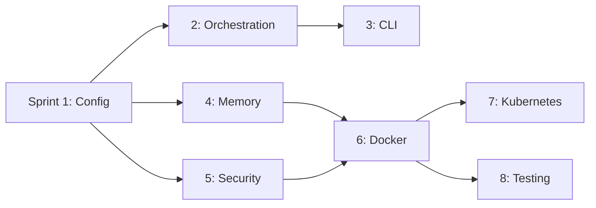

## Sprint Planning Overview: Enhanced AI Agent Hub (2025)

This plan breaks the 8-stage implementation into 8 sprints (1 week each). If team capacity is limited, allow up to 2 weeks per sprint.

### Sprint Cadence
- Duration: 1 week per sprint (optionally 2 weeks)
- Ceremony: Planning (1h), Daily (15m), Review (30m), Retro (30m)

### Mapping Stages to Sprints
- Sprint 0: Foundation & Tooling ✅ COMPLETED (2h, Quality: 92/100)
- Sprint 1: Stage 1 – Configuration (server registry, profiles, bundled servers) ✅ COMPLETED (5h, Quality: 96/100)
- Sprint 2: Stage 2 – Orchestration (gateway, router, load balancer stub)
- Sprint 3: Stage 3 – CLI & Utilities (setup wizard, doctor, npx entry)
- Sprint 4: Stage 4 – Memory & Project Context (local-first)
- Sprint 5: Stage 5 – Security & Credentials (env vars, sandboxing, audit)
- Sprint 6: Stage 6 – Docker Compose (production-ready containers)
- Sprint 7: Stage 7 – Kubernetes (optional deployment manifests)
- Sprint 8: Stage 8 – Testing & Validation (unit, integration, Playwright E2E)

### Dependencies
- S2 depends on S1
- S3 depends on S1, S2
- S4 depends on S1
- S5 depends on S1, S2 (FS sandbox, audit hooks)
- S6 depends on S1–S5
- S7 depends on S6
- S8 depends on S1–S6 (and includes Playwright E2E for hub)

### Success Criteria & Deliverables by Sprint

- Sprint 0 (Foundation) ✅ COMPLETED
  - Success: TypeScript, ESLint, testing framework established
  - Actual Duration: 2 hours (86% faster than estimate)
  - Quality Score: 92/100

- Sprint 1 (Config) ✅ COMPLETED  
  - Success: Registry resolves core + optional MCP servers; default profile loads
  - Deliverables: config/server-registry.json, config/default-profile.json, modular server definitions
  - Actual Duration: 5 hours (67% faster than estimate)
  - Quality Score: 96/100 (after refactoring)

- Sprint 2 (Orchestration)
  - Success: Gateway starts/stops child servers; lists and proxies tools
  - Deliverables: orchestration/gateway.ts, router.ts, load-balancer.ts (stub), logging & health check hooks

- Sprint 3 (CLI)
  - Success: `npx ai-agent-hub` supports setup, doctor, gateway-start
  - Deliverables: bin/cli.mjs, bin/setup-wizard.mjs, bin/doctor.mjs; enquirer prompts; config writes

- Sprint 4 (Memory & Context)
  - Success: Local-first memory (SQLite) and .agent-context files created/updated
  - Deliverables: servers/core/memory/, servers/core/project-context/

- Sprint 5 (Security & Credentials)
  - Success: Secrets via env/secret store; FS sandbox validation; audit JSONL logging
  - Deliverables: security/validation utilities, audit logger, path guards

- Sprint 6 (Docker Compose)
  - Success: `docker compose up -d` runs gateway + optional services (Playwright, Postgres, Redis)
  - Deliverables: Dockerfile, docker-compose.yml, non-root, read-only FS, healthchecks

- Sprint 7 (Kubernetes)
  - Success: `kubectl apply -f k8s/` creates healthy pods (optional)
  - Deliverables: k8s/ deployment, service, config, securityContext

- Sprint 8 (Testing & Validation)
  - Success: Unit + integration pass locally and in CI; Playwright E2E green
  - Deliverables: tests/, Playwright config/specs, CI workflow (optional)

### Scope considerations
- Include optional MCPs where relevant: Supernatural Thinking, Context7, Playwright MCP
- Keep each sprint independently shippable with feature flags/profiles
- Prioritize reliability, security, and developer ergonomics

